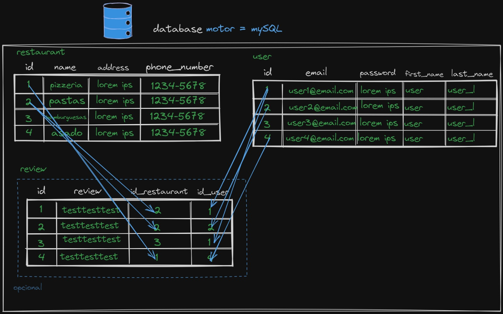

[![Github Status][github-shield]][github-url]

## WeWelcom Challenge 

El objetivo del challenge es crear una RestAPI que permita realizar operaciones CRUD sobre restaurantes, almacenamiento en una base de datos relacional mySQL utilizando Hibernate,
sistema de autenticación básica.

En la carpeta `assets` hay un archivo llamado `testPostman.postman_collection.json`,en ella están todas las pruebas a los endpoints de la API.

De todas maneras, la aplicación está desplegada en la siguiente url: [http://35.247.244.99:8080/api](http://35.247.244.99:8080/api)

Documentación automática con swagger : [http://35.247.244.99:8080/api/swagger/swagger-ui/index.html](http://35.247.244.99:8080/api/swagger/swagger-ui/index.html) y tambien está la sección de [Endpoints](#endpoints)

## Pre-requisitos

+ Maven
+ Java 17
+ Docker & Docker-compose

## Deployment

Para inicializar el proyecto de forma local primero clonamos el mismo y nos posicionamos en la carpeta para ejecutar los siguientes comandos:

```bash
  mvn clean
```
```bash
  mvn install -DskipTests
```
Luego, para inicializar los contenedores, ejecutamos (tener en cuenta que los contenedores corren en los puertos 3306 y 8080):

```bash
  docker-compose up -d
```

## UML


## DER



## Endpoints

### Restaurante

- Registrar nuevo: `POST` a `PATH/api/restaurants`
  - `201 OK` → se registró correctamente
  - `400 BAD REQUEST` → hubo un error en los datos recibidos
    ```json
    {
      "restaurantName" : "nombre",
      "restaurantAddress" : "direccion",
      "restaurantPhoneNumber" : "12345678"
    }
    ```
- Buscar por id: `GET` a `PATH/api/restaurants/{id}`

  - `200 OK` → devuelve el restaurate
  - `404 NOT FOUND` → no se encontró un restaurante con ese id

- Actualizar existente: `PUT` a `/api/restaurants/1`
  - `200 OK` → se actualizó correctamente
  - `400 BAD REQUEST` → hubo un error en los datos recibidos
  - `404 NOT FOUND` → no se encontró el restaurante con id recibido
    ```json
    {
      "restaurantName" : "nombreNuevo",
      "restaurantAddress" : "direccionNueva",
      "restaurantPhoneNumber" : "123456789"
    }
    ```
- Eliminar por id: `DELETE` a `PATH/api/restaurants/delete/{id}`

  - `200 NO CONTENT` → se borró correctamente
  - `404 NOT FOUND` → no se encontró el restaurante con id recibido

- Obtener todos: `GET` a `PATH/api/restaurants/list`

### User

- Registrar nuevo: `POST` a `PATH/api/users/register`

  - `200 OK` → se registró correctamente
  - `400 BAD REQUEST` → hubo un error en los datos recibidos
    ```json
    {
      "userEmail" : "user@email.com",
      "userPassword" : "password",
      "userFirstName" : "userNombre",
      "userLastName" : "userApellido"
    }
    ```

- Ingresar : `POST` a `PATH/api/users/login`

  - `200 OK` → se registró correctamente
  - `400 BAD REQUEST` → hubo un error en los datos recibidos
    ```json
    {
      "userEmail" : "user@email.com",
      "userPassword" : "password",
    }
    ```

### Review

- Crear nuevo: `POST` a `PATH/reviews/create/{userId}/{restaurantId}`

  - `200 OK` → se registró correctamente
  - `400 BAD REQUEST` → hubo un error en los datos recibidos
    ```json
    {
      "reviewText" : "esto es una review"
    }
    ```

- Buscar por id: `GET` a `PATH/reviews/{restaurantId}`

[github-shield]: https://img.shields.io/badge/GitHub-trashfacu-blue?logo=github&style=flat
[github-url]: https://github.com/trashfacu/RantMyGameAPI